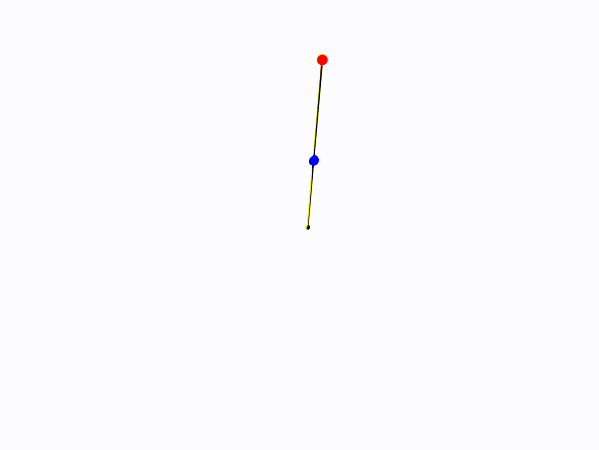
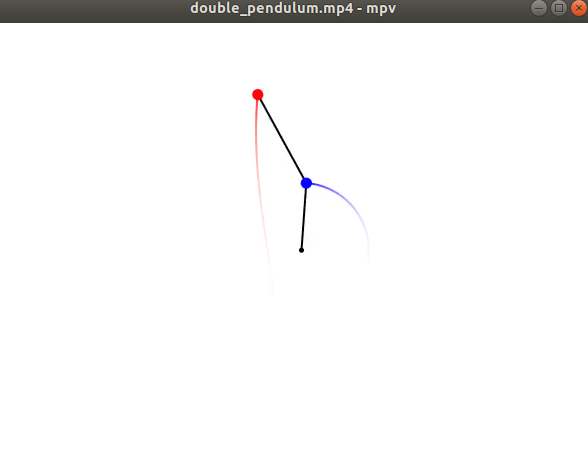

# Double-Pendulum-Simulation
A small project that produces mp4 and gif animations from a docker image of the physics double pendulum simulation.

## Build the Docker image
Building the docker image is simple. Just git clone the repo, cd into the root of the repo, and docker build it.

You may call it whatever you like.
```
$ sudo docker build -t double_pendulum:latest .
```

## Run the Docker image
The docker container will produce the a mp4 file and a gif file in the /work/app/animations directory.
Thus, map the directory you want the animations to come out with the -v option. 

Below is an example of running the docker container, and having the files outputted in the current working directory.
```
$ sudo docker run --rm -v $PWD:/work/app/animations double_pendulum
```

## Parameters
The docker image accepts a bunch of parameters to change the masses, lengths, time frames, etc of the simulation.

Here is the output from the running the docker container with the -h option.

```
$ sudo docker run --rm -v $PWD:/work/app/animations double_pendulum -h
Running the program.
usage: main.py [-h] [--l1 [L1]] [--l2 [L2]] [--m1 [M1]] [--m2 [M2]]
               [--o1 [O1]] [--o2 [O2]] [--w1 [W1]] [--w2 [W2]]
               [--t_max [T_MAX]] [--dt [DT]]

optional arguments:
  -h, --help       show this help message and exit
  --l1 [L1]        The length of the first rod in meters. Default is 1.0.
  --l2 [L2]        The length of the second rod in meters. Default is 1.0.
  --m1 [M1]        The length of the first ball in kilograms. Default is 1.0.
  --m2 [M2]        The length of the second ball in kilograms. Default is 1.0.
  --o1 [O1]        The initial angle of the first pendulum in degrees. Default
                   is 175.0.
  --o2 [O2]        The initial angle of the second pendulum in degrees.
                   Default is 175.0.
  --w1 [W1]        The initial angular speed of the first pendulum in degrees
                   per second. Default is 0.0.
  --w2 [W2]        The initial angular speed of the second pendulum in degrees
                   per second. Default is 0.0.
  --t_max [T_MAX]  The upper time bound in seconds. t_max is inclusive. The
                   lower time bound is zero.Default is 60.0. Has to be greater
                   than 1.0.
  --dt [DT]        The time step in seconds. Default is 0.01. Has to be less
                   than 0.01

```

## Example
The gif and mp4 animations produced from these following parameters can be found in the examples directory.
```
$ sudo docker run --rm -v $PWD:/work/app/animations dp_app --l1 2.0 --l2 3.0 --m2 1.5 --w1 30 --w2 -30
```

This is the gif animation.



A screenshot of the mp4 animation that can be found in examples/double_pendulum_example.mp4.



Note that the gif quality isn't as great as the mp4 quality.
 
I used ffmpeg to produce both animations. 

ImageMagick was another option to make gifs. However, it eats up all the RAM memory and crashes the computer when making
a gif from a few hundred images.

## Testing
You can run the --test option to run the tests. I experimented with type annotations and used mypy for this project. I 
run my unit tests with pytest and the coverage plugin, pytest-cov. 

Example of test output.
```
sudo docker run --rm -v $PWD:/work/app/animations double_pendulum --test

Running the mypy tests.
Success: no issues found in 3 source files

Running the pytest tests.
============================= test session starts ==============================
platform linux -- Python 3.8.2, pytest-5.3.5, py-1.8.1, pluggy-0.13.1
rootdir: /work, inifile: pytest.ini
plugins: cov-2.8.1
collected 3 items

tests/test_double_pendulum_functions.py .                                [ 33%]
tests/test_main.py ..                                                    [100%]

----------- coverage: platform linux, python 3.8.2-final-0 -----------
Name                               Stmts   Miss  Cover
------------------------------------------------------
app/double_pendulum_functions.py     108      0   100%
app/main.py                           45      0   100%
------------------------------------------------------
TOTAL                                153      0   100%


======================== 3 passed in 208.52s (0:03:28) =========================
```